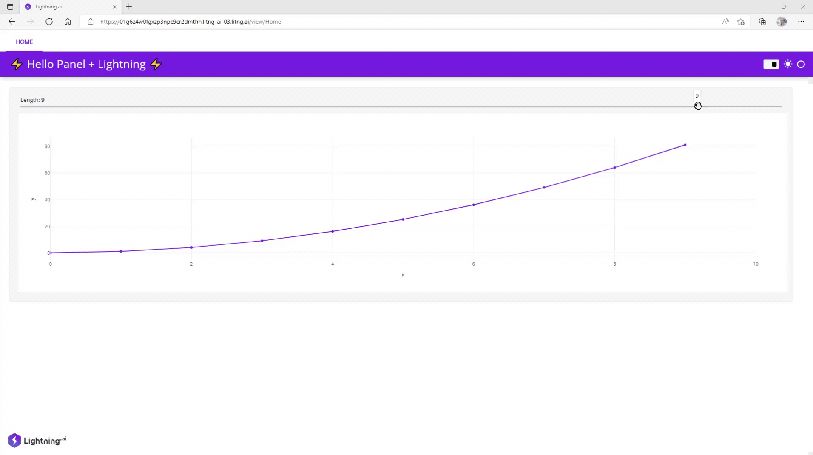

 [](https://twitter.com/MarcSkovMadsen)

# ⚡ Panel Lightning Basic Web UI

Basic example of a [Panel](https://panel.holoviz.org) [lightning.ai](https://lightning.ai/) Lightning Web UI.



## ⚙️ Install Locally

```bash
git clone https://github.com/MarcSkovMadsen/panel-lightning-basic.git
cd awesome-panel-lightning
```

[Create](https://realpython.com/python-virtual-environments-a-primer/#create-it) and [activate](https://realpython.com/python-virtual-environments-a-primer/#activate-it) your local environment.

Then install the requirements via

```bash
pip install -r requirements.txt
```

Finally you can update the `name` of the app in the [.lightning](.lightning) file.

## Develop Locally

Develop the Panel app locally with hot reload

```bash
panel serve app.py --autoreload --show
```

## 🏃 Run Locally

Run the lightning app locally via

```bash
lightning run app app.py
```

## ☁️ Run in lightning.ai cloud

Run the lightning app in the cloud via

```bash
lightning run app app.py --cloud
```

and follow the instructions
